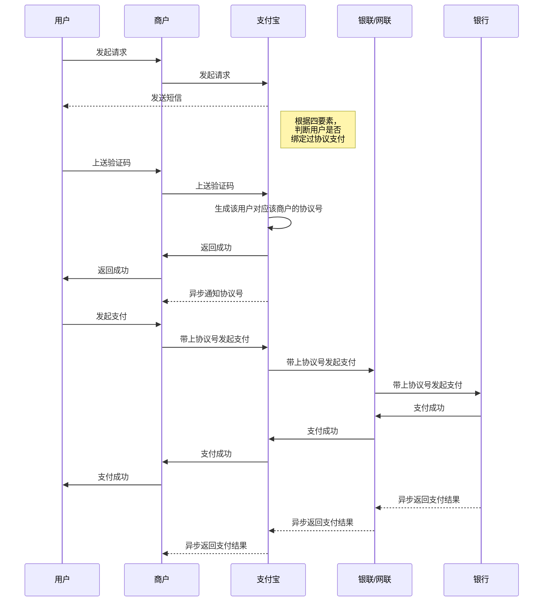

---
html:
    toc: true
    embed_local_images: true
---


# Markdown语法
##  一、标题
* 标题一 `#`
* 标题二 `##`
* 标题三 `###`
* 标题四 `####`
* 标题五 `#####`
* 标题六 `######`
  
## 二、序列
### 1、无序序列
* 无序一 `*`
* 无序二 `*`
  
+ 无序一 `+`
+ 无序二  `+`

- 无序一 `-`
- 无序二 `-`
  
### 2、有序序列
1. 有序一 `1.`
2. 有序二 `2.`

## 三、文本强调及删除线
- *强调* `*文本*`
- _强调_ `_文本_`
- **强调** `**文本**`
- __强调__ `__文本__`
- ~~删除线~~ `~~删除线~~`

## 四、代码块
`代码块` 
```
大段```代码```块
 ```
 -  `> 嵌套一`
 -  `>> 嵌套二`
 -  `>>> 嵌套三`
 > 嵌套一
 >> 嵌套二 
 >>> 嵌套三
 >>>> 嵌套四
 >>>>> 嵌套五
 >>>>>> 嵌套六

## 五、链接及图片
- [行内式](http://www.baidu.com) `[行内式](http://www.baidu.com)`
- 
- ``

## 六、分割线(至少三个)
- `***` 
- `_ _ _`
- `---`
  
## 七、表格
- 表格用 `|`表示
- 左对齐 `:-`
- 右对齐 `-:`
- 居中对齐 `:-:`


|左对齐左对齐|右对齐右对齐|居中对齐居中对齐|
|:---|---:|:-:|
|表格|表格|居中对齐|


## 八、空行
`&nbsp;`
`&nbsp;`
`&nbsp;`

## 九、时序图
- mermaid
- sequenceDiagram
- 实线：用户->>商户: 发起请求
- 虚线：支付宝-->>用户: 发送短信
- 备注：Note right of 支付宝: 根据四要素，<br/>判断用户是否<br/>绑定过协议支付


***
|这是备案号这是备案号这是备案号这是备案号这是备案号这是备案号这是备案号这是备案号这是备案号这是备案号这是备案号|
|-:|
|[浙ICP备2022014244号](https://beian.miit.gov.cn/)|
