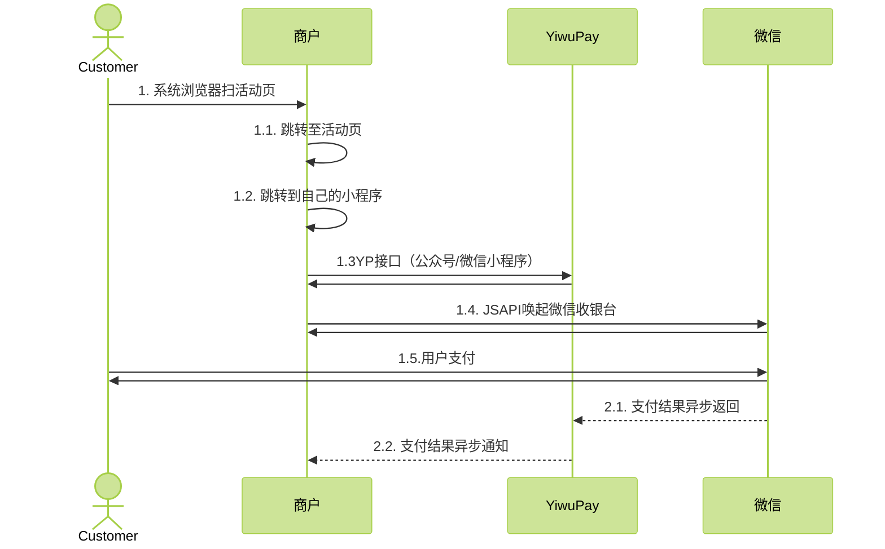
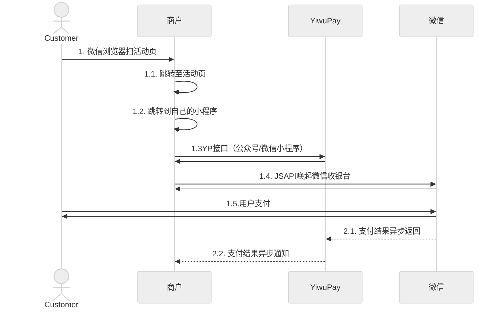

---
html:
    toc: true
    embed_local_images: true
---

# H5及微信浏览器跳转微信小程序
## 一、非微信浏览器H5跳转微信小程序

#### 1、官方文档
- 获取 URL Link简介
```http
https://developers.weixin.qq.com/miniprogram/dev/framework/open-ability/url-link.html
```
- 前端文档及体验二维码
```http
https://developers.weixin.qq.com/miniprogram/dev/wxcloud/guide/staticstorage/jump-miniprogram.html
```
- 后端文档
```http
生成 URL Link接口文档 
https://developers.weixin.qq.com/miniprogram/dev/OpenApiDoc/qrcode-link/url-link/generateUrlLink.html
```
```http
获取accessToken接口文档
https://developers.weixin.qq.com/miniprogram/dev/OpenApiDoc/mp-access-token/getAccessToken.html
```
#### 2、功能描述
    该功能主要实现【微信外浏览器】H5通过 URL Link 跳转到微信小程序唤起微信支付。(可选择云开发和非云开发)
#### 3、时序图


#### 4、前期准备
- 非云开发简述
    1. 微信小程序申请，获取到微信小程序的`appId`,`appSecret`
    2. 后端通过【获取accessToken接口文档】获取到`accessToken`
    3. 后端通过【生成 URL Link接口文档 】,带上小程序支付页面路径及参数，获取到`URL Link`,并返回给前端
    4. 前端通过`URL Link`跳转微信小程序支付页面
    5. 可以在`Page` 的`onLoad` 中获取参数，唤起支付
#### 5、注意事项
1. 通过 URL Link 从微信外打开小程序的场景值为 1194
2. 只能生成已发布的小程序的 URL Link
3. 在微信内或者安卓手机打开 URL Link 时，默认会先跳转官方 H5 中间页，如果需要定制 H5 内容，可以使用云开发静态网站。
4. 每天生成 URL Link 总数量上限为50万

#### 6、前端H5代码
```js
location.href =  urlLink
```
#### 7、小程序代码
```js
// 获取传入参数
Page({
  onLoad (query) {
    // param 为参数的key，param 需要使用 decodeURIComponent 才能获取到生成二维码时传入的 param
    const scene = decodeURIComponent(query.param)
  }
})
```


## 二、微信内H5跳转微信小程序
#### 1、官方文档
```http
https://developers.weixin.qq.com/doc/offiaccount/OA_Web_Apps/Wechat_Open_Tag.html#21
```
#### 2、功能描述
    该功能主要实现【微信浏览器】通过微信服务号H5开放标签 wx-open-launch-weapp 跳转到微信小程序唤起微信支付。
#### 3、时序图


#### 4、前期准备
- 简述
  1. 微信小程序申请，获取到微信小程序的`appId`,`appSecret`
  2. 微信服务号申请，并认证
  3. 在服务号`JS接口安全域名`下的绑定H5网页的域名
  4. 前端通过`wx-open-launch-weapp`跳转微信小程序支付页面
  5. 可以在`Page` 的`onLoad` 中获取参数，唤起支付
#### 5、注意事项
1. 服务号要认证
2. 在服务号`JS接口安全域名`下的绑定H5网页的域名
#### 6、前端H5代码
```js
<wx-open-launch-weapp
  id="launch-btn"
  appid="wx12345678（微信小程序的appid）"
  path="pages/home/index?user=123&action=abc"
>
  <script type="text/wxtag-template">
    <style>.btn { padding: 12px }</style>
    <button class="btn">打开小程序</button>
  </script>
</wx-open-launch-weapp>
<script>
  var btn = document.getElementById('launch-btn');
  btn.addEventListener('launch', function (e) {
    console.log('success');
  });
  btn.addEventListener('error', function (e) {
    console.log('fail', e.detail);
  });
</script>
```
#### 7、小程序代码
```js
// 获取传入参数
Page({
  onLoad (query) {
    // param 为参数的key，param 需要使用 decodeURIComponent 才能获取到生成二维码时传入的 param
    const scene = decodeURIComponent(query.param)
  }
})
```
***
*written by Shawn*
*Copyright © 2023 YiwuPay*
